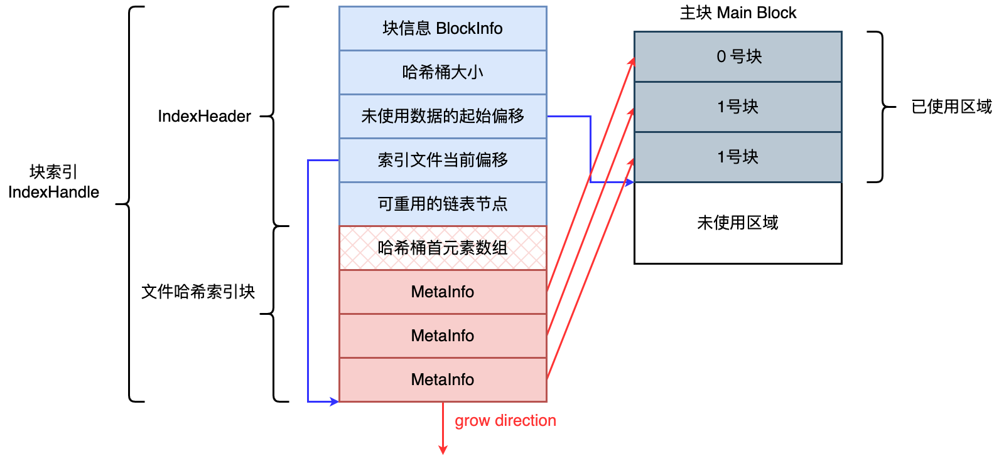
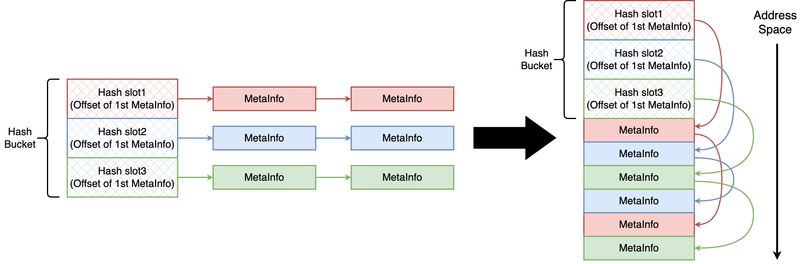

# LargeFileSystem

## *设计*

### 为什么不能存小文件？

* 大规模的小文件存取，磁头需要频繁的寻道和换道，因此在读取上容易带来较长的延时

  大概过程是：目录寻址查找 inode Number -> inode table寻址，获取inode信息 -> 块寻址及读取数据

* 频繁的新增删除操作会导致磁盘碎片，降低磁盘利用率和IO读写效率

* Inode抢占了大量缓存空间，实际降低了真正需要的数据在缓冲中的命中率

### 设计思路

* 以block文件的形式存放数据文件，一般64M一个block，理论上使用128、256、512MB都行，但是淘宝大文件系统推荐使用64MB。以下简称为“块”，每个块都有唯一的一个整数编号，块在使用之前所用到的存储空间都会预先分配和初始化（减少磁盘碎片、提高响应速度）。注意：这个逻辑上的块和Linux OS中块程序中的512～4KB的块没有关系
* 每一个块由一个索引文件、一个主块文件和若干个扩展块组成，“小文件”主要存放在主块中，扩展块主要用来存放溢出的数据
* 每个索引文件存放对应的块信息和“小文件”索引信息，索引文件会在服务启动时映射（`mmap`）到内存，从而极大的提高文件检索速度。“小文件”索引信息采用在索引文件中的数据结构哈希链表来实现
* 每个文件有对应的文件编号，文件编号从1开始编号，依次递增，同时作为哈希查找算法的Key来定位“小文件”在主块和扩展块中的偏移量。文件编号+块编号按某种算法可得到“小文件”对应的文件名

## *系统调用封装*

在Large File System中主要用到了mmap和文件相关的系统调用。无论何时只要执行了系统调用或者库函数，检查调用的返回状态以确定调用是否成功是系统编程的基本素养

如果不经封装直接使用Linux的系统调用，这些操作在之后实现文件系统的时候比较繁琐，因此我们先把这些系统调用结合我们的项目的具体需要封装成类，方便之后的使用

### mmap_file

提供了三种构造函数

```c++
MMapFile();
explicit MMapFile(const int fd);
MMapFile(const MMapOption &mmap_option, const int fd);
```

* explicit禁止隐式类型转换

* MMapOption方便后期调整内存映射

  ```c++
  struct MMapOption {
    int32_t max_mmap_size_;    // 最大映射空间尺寸，例：3M
    int32_t first_mmap_size_;  // 首次映射尺寸，例：4K
    int32_t per_mmap_size_;    // 之后可以继续递增尺寸，例：2K
  };
  ```

Mmap_file中封装了mmap、munmap、msync、remap，还有针对已映射文件的read、write接口

ensure_file_size 是一个重要的类内部的复用接口，用来保证物理上的文件大小足以容纳要映射的内存中的大小

### file_op

### mmap_file_op

我们的最终目标是要对经过mmap映射到内存中的内容进行文件操作，所以封装mmap_file_op

## *核心数据结构*



块索引是记录整个主块信息，而文件哈希索引块是动态变化的，来应对主块的增删





和一般哈希桶用存放下一个元素的地址不同，这里哈希桶首元素数组里面存放的是对应MetaInfo在整个IndexHandle中的偏移量

有几个桶/slot


每一个slot上挂的链表跟


### BlockInfo

```c
struct BlockInfo {
  uint32_t block_id_;             //块编号   1 ......2^32-1  TFS = NameServer + DataServer
  int32_t version_;               //块当前版本号
  int32_t file_count_;            //当前已保存文件总数
  int32_t size_;                  //当前已保存文件数据总大小
  int32_t del_file_count_;        //已删除的文件数量
  int32_t del_size_;              //已删除的文件数据总大小
  uint32_t seq_no_;               //下一个可分配的文件编号  1 ...2^64-1    
}
```

`del_file_count_` 和 `del_size_`：删除的时候是不会立刻删除的，因为需要大量IO。当积累已删除文件到一定指标的时候需要在某个时间段进行集中处理


### 索引

```c
struct MetaInfo {
     RawMeta raw_meta_;              //文件元数据
     int32_t next_meta_offset_;      //当前哈希链下一个节点在索引文件中的偏移量
} 
```


```c
struct RawMeta {
    uint65_t field_;               //文件编号
	struct {
        int32_t inner_offset_;     //文件在块内部的偏移量
        int32_t size_;             //文件大小
    } location_;
};
```


可重用链表：已经删除的块的metainfo连接起来 


### 块初始化 create

1. 生成主块文件
   * 根据id创建文件
   * 预分配文件
2. 生成索引文件
   * 根据id创建文件
   * 头部初始化
     * 块信息初始化
     * 索引信息初始化
   * 同步写入磁盘
   * 映射至内存访问

### 块中写入文件

1. 加载索引文件 load：映射索引文件至内存
2. 文件写入至主块
   * 从索引文件中读取块数据偏移
   * 将文件写入主块的对应偏移位置中
3. 文件索引信息写入索引文件
   * 生成 MetaInfo 信息（包括文件在块中的fd）
   * 将 MetaInfo 写入索引文件
   * 更新块信息 BlockInfo & 相关偏移量

### 块中读取文件

1. 加载索引文件：映射索引文件至内存
2. 从索引文件中获取文件MetaInfo：据文件id从块索引内存映射的Hash文件链表中查找文件的MetaInfo
3. 根据MetaInfo 从主块中读取文件

### 块中删除文件

1. 加载索引文件：映射索引文件至内存
2. 从索引文件中获取文件MetaInfo：根据文件id从块索引内存映射的Hash文件链表中查找文件的MetaInfo
3. 索引文件中删除MetaInfo
   * 将当前文件对应MetaInfo在哈希链表中的上一个节点指向其后的节点
   * 当前MetaInfo 加入可重用空闲节点链表中
   * 更新块信息